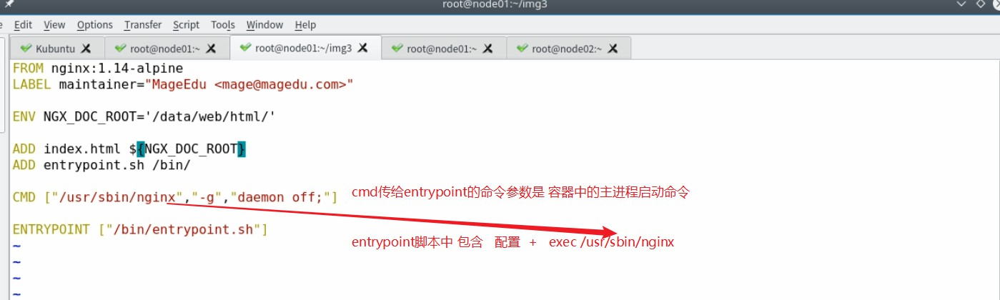

前言
+ 原创学习笔记
+ 第一次做markdown笔记,以后会努力做得更好的~
+ 前半段用的是markdownpad+imgur,直到发现了VScode,才知道什么叫做神器...

<!-- TOC -->

- [1. 容器技术的发展史](#1-容器技术的发展史)
    - [1.1. 传统的容器技术是虚拟机技术,它的虚拟化方式有两种](#11-传统的容器技术是虚拟机技术它的虚拟化方式有两种)
    - [1.2. 新的容器技术是利用命名空间,对内核进行虚拟化,减少了资源浪费](#12-新的容器技术是利用命名空间对内核进行虚拟化减少了资源浪费)
    - [1.3. 命名空间](#13-命名空间)
        - [1.3.1. pid 命名空间](#131-pid-命名空间)
        - [1.3.2. net 命名空间](#132-net-命名空间)
        - [1.3.3. ipc 命名空间](#133-ipc-命名空间)
        - [1.3.4. mnt 命名空间](#134-mnt-命名空间)
        - [1.3.5. uts 命名空间](#135-uts-命名空间)
        - [1.3.6. user 命名空间](#136-user-命名空间)
    - [1.4. docker的一些优点](#14-docker的一些优点)
    - [1.5. docker杂谈](#15-docker杂谈)
- [2. docker的基本使用](#2-docker的基本使用)
    - [2.1. docker的架构组成](#21-docker的架构组成)
    - [2.2. 镜像仓库的存放准则](#22-镜像仓库的存放准则)
    - [2.3. 一个镜像仓库只存放一个应用程序的不同版本镜像,比如nginx的不同版本](#23-一个镜像仓库只存放一个应用程序的不同版本镜像比如nginx的不同版本)
    - [2.4. docker安装杂记](#24-docker安装杂记)
    - [2.5. 清华镜像站里面可以查看镜像的内部文件 可以从centos7中发现,cent7的extras中带有一个老版本docker](#25-清华镜像站里面可以查看镜像的内部文件-可以从centos7中发现cent7的extras中带有一个老版本docker)
    - [2.6. docker 常用命令:](#26-docker-常用命令)
    - [2.7. 可以选择的镜像标签:](#27-可以选择的镜像标签)
    - [2.8. docker的虚拟网卡](#28-docker的虚拟网卡)
    - [2.9. docker的基本使用](#29-docker的基本使用)
    - [2.10. docker镜像的底层原理](#210-docker镜像的底层原理)
- [3. docker 制作镜像](#3-docker-制作镜像)
    - [3.1. 基于容器制作镜像](#31-基于容器制作镜像)
    - [3.2. docker镜像与TAG的硬链接原理](#32-docker镜像与tag的硬链接原理)
    - [3.3. 将镜像push到仓库中](#33-将镜像push到仓库中)
    - [3.4. push的 账号/镜像名:TAG   应该与账号和远程仓库名对应](#34-push的-账号镜像名tag---应该与账号和远程仓库名对应)
    - [3.5. 镜像的导入导出](#35-镜像的导入导出)
    - [3.6. 跨过pull 镜像,在两台服务器间传递打包的文件](#36-跨过pull-镜像在两台服务器间传递打包的文件)
- [4. 容器的虚拟网络模型](#4-容器的虚拟网络模型)
    - [4.1. 容器的四种虚拟网络模型](#41-容器的四种虚拟网络模型)
    - [4.2. bridge模型](#42-bridge模型)
    - [4.3. 容器的虚拟网卡与docker0相连](#43-容器的虚拟网卡与docker0相连)
    - [4.4. 可以看到有三个容器的网卡与docker0相连](#44-可以看到有三个容器的网卡与docker0相连)
    - [4.5. docker容器桥接模式暴露端口](#45-docker容器桥接模式暴露端口)
    - [4.6. 修改docker0(docker daemon)的ip地址](#46-修改docker0docker-daemon的ip地址)
    - [4.7. docker容器共享模式](#47-docker容器共享模式)
    - [4.8. 容器间共享ip](#48-容器间共享ip)
    - [4.9. 宿主机与容器共享ip](#49-宿主机与容器共享ip)
- [5. docker存储卷](#5-docker存储卷)
    - [5.1. docker存储卷挂载到宿主机](#51-docker存储卷挂载到宿主机)
    - [5.2. docker容器间共享宿主机存储](#52-docker容器间共享宿主机存储)
    - [5.3. docker容器复制其他容器的存储卷](#53-docker容器复制其他容器的存储卷)
- [6. DockerFile的制作](#6-dockerfile的制作)
    - [6.1. 构建镜像语法](#61-构建镜像语法)
    - [6.2. FROM](#62-from)
    - [6.3. LABEL](#63-label)
    - [6.4. COPY](#64-copy)
    - [6.5. ADD](#65-add)
    - [6.6. WORKDIR](#66-workdir)
    - [6.7. VOLUME](#67-volume)
    - [6.8. EXPOSE](#68-expose)
    - [6.9. ENV](#69-env)
    - [6.10. RUN & CMD](#610-run--cmd)
    - [6.11. ENTRYPOINT](#611-entrypoint)
        - [6.11.1. exec顶替shell启动主进程:](#6111-exec顶替shell启动主进程)
        - [6.11.2. ENTRYPOINT的使用](#6112-entrypoint的使用)
            - [6.11.2.1. cmd和entrypoint的区别](#61121-cmd和entrypoint的区别)
    - [6.12. HEALTHCHECK](#612-healthcheck)
    - [6.13. SHELL](#613-shell)
    - [6.14. STOPSIGNAL](#614-stopsignal)
    - [6.15. ONBUILD](#615-onbuild)
- [7. 搭建私有registry](#7-搭建私有registry)
- [8. VMWARE_HARBOR](#8-vmware_harbor)
    - [8.1. VMwareHarbor](#81-vmwareharbor)
- [9. 资源限制](#9-资源限制)
- [10. K8S](#10-k8s)
    - [10.1. K8s发展杂谈](#101-k8s发展杂谈)
    - [10.2. K8s基础知识](#102-k8s基础知识)
        - [10.2.1. 基本功能](#1021-基本功能)
        - [10.2.2. 架构](#1022-架构)
        - [10.2.3. K8s的Pass概述](#1023-k8s的pass概述)
        - [10.2.4. PaaS的业务模式发展](#1024-paas的业务模式发展)
- [11. DevOps(持续集成和持续部署)](#11-devops持续集成和持续部署)
    - [11.1. 架构图](#111-架构图)
    - [11.2. CI/CD相关技术](#112-cicd相关技术)
        - [后续回顾](#后续回顾)

<!-- /TOC -->

# 1. 容器技术的发展史

## 1.1. 传统的容器技术是虚拟机技术,它的虚拟化方式有两种

1. 在宿主机上虚拟出多个内核,在内核上分别创建虚拟机;
2. 直接在硬件资源上创建内核(跳过宿主机系统),在内核上创建虚拟机;

**这样会造成严重的资源浪费,哪怕只想运行一个web服务,都要虚拟出一个主机**

## 1.2. 新的容器技术是利用命名空间,对内核进行虚拟化,减少了资源浪费

命名空间的分类如图:

因为用户命名空间在linux的支持版本较晚,也据定了centos6的内核版本不适合用docker,即使高版本内核可用也很不稳定;

因为虚拟机技术的资源浪费,由此诞生了第一种使用同一个内核,而不需要再分离出多个内核(节省资源)的容器技术Linux Container

LXC技术是利用自己创建的模板,对内核进行命名空间的划分,然后生成一个容器,在容器内运行多个进程,但这样有一个缺点是生成的容器内的数据很难迁移,模板生成也十分复杂;

所以就诞生了docker技术,docker技术的底层其实就是LXC,它其实是对LXC技术的封装;
## 1.3. 命名空间
命名空间是 Linux 内核一个强大的特性。每个容器都有自己单独的命名空间，运行在其中的应用都像是在独立的操作系统中运行一样。命名空间保证了容器之间彼此互不影响。

### 1.3.1. pid 命名空间
不同用户的进程就是通过 pid 命名空间隔离开的，且不同命名空间中可以有相同 pid。所有的 LXC 进程在 Docker 中的父进程为Docker进程，每个 LXC 进程具有不同的命名空间。同时由于允许嵌套，因此可以很方便的实现嵌套的 Docker 容器。

### 1.3.2. net 命名空间
有了 pid 命名空间, 每个命名空间中的 pid 能够相互隔离，但是网络端口还是共享 host 的端口。网络隔离是通过 net 命名空间实现的， 每个 net 命名空间有独立的 网络设备, IP 地址, 路由表, /proc/net 目录。这样每个容器的网络就能隔离开来。Docker 默认采用 veth 的方式，将容器中的虚拟网卡同 host 上的一 个Docker 网桥 docker0 连接在一起。

### 1.3.3. ipc 命名空间
容器中进程交互还是采用了 Linux 常见的进程间交互方法(interprocess communication - IPC), 包括信号量、消息队列和共享内存等。然而同 VM 不同的是，容器的进程间交互实际上还是 host 上具有相同 pid 命名空间中的进程间交互，因此需要在 IPC 资源申请时加入命名空间信息，每个 IPC 资源有一个唯一的 32 位 id。

### 1.3.4. mnt 命名空间
类似 chroot，将一个进程放到一个特定的目录执行。mnt 命名空间允许不同命名空间的进程看到的文件结构不同，这样每个命名空间 中的进程所看到的文件目录就被隔离开了。同 chroot 不同，每个命名空间中的容器在 /proc/mounts 的信息只包含所在命名空间的 mount point。

### 1.3.5. uts 命名空间
UTS("UNIX Time-sharing System") 命名空间允许每个容器拥有独立的 hostname 和 domain name, 使其在网络上可以被视作一个独立的节点而非 主机上的一个进程。

### 1.3.6. user 命名空间
每个容器可以有不同的用户和组 id, 也就是说可以在容器内用容器内部的用户执行程序而非主机上的用户。

## 1.4. docker的一些优点

它相对于LXC的一大优点是可以很轻松的创建和自定义镜像,存储在云仓库中,在使用的时候拉取运行即可;

docker在**一个容器中只运行一个进程**,进程之间通过容器的方式进行通信,比如tomcat和Nginx;

**docker可以将容器打包,它不再依赖内核的命名空间,而是拥有自己独立的命名空间,就使得自己的运行环境完全独立于平台,就实现了分发镜像的极大便利;**

docker的联合挂载机制(极大的优点)


## 1.5. docker杂谈

google早在十年前就秘密使用了docker技术和容器编排工具borg
后来docker公司为了盈利,发布了容器编排工具docker compose,docker machine,docker swarm(实现容器的资源管理),但此时google为了防止自己丧失容器编排技术的话语权,把内部成熟的borg用go语言重写了k8s,因为google丰富的容器使用经验,使得k8s碾压docker的容器编排工具

docker公司为了盈利,就把docker分为了社区版(更名moby)和企业版(docker) 为的往企业版docker引流,获取投资和利润;而相比之下,google成立CNCF委员会来脱离出google引导k8s的健康发展; 使得世界对k8s的支持呼声极高

docker在发展壮大起来后,开发了新的引擎libcontainer,抛弃了原来的LXC;又在社区版和企业版上吃相难看,其过河拆桥之行为与世界技术的发展背道而驰

容器技术的使用需要制定行业标准,CNCF完全有能力制定标准,而且为了保证不被docker一家公司控制,CNCF将docker排除在外,但是也给了docker一个改过自新的机会,让docker把自己开发的新引擎libcontainner更名为runC作为**容器技术引擎的标准**

# 2. docker的基本使用

## 2.1. docker的架构组成


+ daemon:守护进程(后台进程)  用来拉取镜像和运行容器(容器是镜像的一个动态实例)
+ docker client : docker的客户终端
+ docker register: docker仓库 (用来存放镜像) + 用户认证功能


## 2.2. 镜像仓库的存放准则

## 2.3. 一个镜像仓库只存放一个应用程序的不同版本镜像,比如nginx的不同版本


## 2.4. docker安装杂记


## 2.5. 清华镜像站里面可以查看镜像的内部文件 可以从centos7中发现,cent7的extras中带有一个老版本docker
 


也可以从清华镜像站中,找到docker-ce镜像:


## 2.6. docker 常用命令:


## 2.7. 可以选择的镜像标签:


alpine:是轻量版,缺少测试工具,不建议使用

## 2.8. docker的虚拟网卡


## 2.9. docker的基本使用


## 2.10. docker镜像的底层原理


# 3. docker 制作镜像


## 3.1. 基于容器制作镜像

```linux
[root@sx ~]# docker ps
CONTAINER ID        IMAGE               COMMAND                  CREATED              STATUS              PORTS                    NAMES
27c586590860        centos              "/bin/bash"              About a minute ago   Up 59 seconds                                cent7
2685adbf571c        redis               "docker-entrypoint.s…"   5 hours ago          Up 5 hours          0.0.0.0:6379->6379/tcp   redis63
[root@sx ~]# docker commit cent7 sunxuxu/mycentos7:v1
sha256:fbf50e3ebc88857d42f3ee8a8c455f05e5e8526595d295f5c94f3f86d5f6add5
[root@sx ~]# docker images
REPOSITORY          TAG                 IMAGE ID            CREATED             SIZE
sunxuxu/mycentos7   v1                  fbf50e3ebc88        15 seconds ago      202MB
rabbitmq            management          476495614692        11 days ago         194MB
redis               alpine              72e76053ebb7        2 weeks ago         50.9MB
redis               latest              d3e3588af517        2 weeks ago         95MB
centos              latest              9f38484d220f        2 months ago        202MB
registry            latest              f32a97de94e1        2 months ago        25.8MB
hello-world         latest              fce289e99eb9        5 months ago        1.84kB
[root@sx ~]# docker tag fbf50e3ebc88 sunxu/mycent:v2
[root@sx ~]# docker images
REPOSITORY          TAG                 IMAGE ID            CREATED             SIZE
sunxuxu/mycentos7   v1                  fbf50e3ebc88        54 seconds ago      202MB
sunxu/mycent        v2                  fbf50e3ebc88        54 seconds ago      202MB
rabbitmq            management          476495614692        11 days ago         194MB
redis               alpine              72e76053ebb7        2 weeks ago         50.9MB
redis               latest              d3e3588af517        2 weeks ago         95MB
centos              latest              9f38484d220f        2 months ago        202MB
registry            latest              f32a97de94e1        2 months ago        25.8MB
hello-world         latest              fce289e99eb9        5 months ago        1.84kB
```
## 3.2. docker镜像与TAG的硬链接原理


## 3.3. 将镜像push到仓库中
## 3.4. push的 账号/镜像名:TAG   应该与账号和远程仓库名对应


## 3.5. 镜像的导入导出

## 3.6. 跨过pull 镜像,在两台服务器间传递打包的文件


# 4. 容器的虚拟网络模型
## 4.1. 容器的四种虚拟网络模型


## 4.2. bridge模型


## 4.3. 容器的虚拟网卡与docker0相连


## 4.4. 可以看到有三个容器的网卡与docker0相连


```
docker run -it --name containername  --network bridge  -h sunxu.com --dns 8.8.8.8 --rm image:tag
#network  指定网络模式 还有none host
#-h 指定docker容器的主机名
#dns 指定docker容器的dns服务器

#上面的参数可以在docker容器的 /etc/resolv.conf中找到
```
## 4.5. docker容器桥接模式暴露端口
docker run -it --name test -p 192.168.30.70:5432:5432 redis


## 4.6. 修改docker0(docker daemon)的ip地址
```
vim /etc/docker/daemon.json

{
"bip":"10.0.0.1/16"
}


systemctl restart docker.service

[root@sx ~]# ifconfig
docker0: flags=4099<UP,BROADCAST,MULTICAST>  mtu 1500
        inet 10.0.0.1  netmask 255.255.0.0  broadcast 10.0.255.255
        ether 02:42:d8:a7:41:03  txqueuelen 0  (Ethernet)
        RX packets 0  bytes 0 (0.0 B)
        RX errors 0  dropped 0  overruns 0  frame 0
        TX packets 0  bytes 0 (0.0 B)
        TX errors 0  dropped 0 overruns 0  carrier 0  collisions 0

ens33: flags=4163<UP,BROADCAST,RUNNING,MULTICAST>  mtu 1500
        inet 192.168.245.4  netmask 255.255.255.0  broadcast 192.168.245.255
        inet6 fe80::d4f2:8d5f:bf2:dbf0  prefixlen 64  scopeid 0x20<link>
        ether 00:0c:29:90:e6:8d  txqueuelen 1000  (Ethernet)
        RX packets 452  bytes 43605 (42.5 KiB)
        RX errors 0  dropped 0  overruns 0  frame 0
        TX packets 317  bytes 50079 (48.9 KiB)
        TX errors 0  dropped 0 overruns 0  carrier 0  collisions 0
```


## 4.7. docker容器共享模式
## 4.8. 容器间共享ip

```
开启container1
docker run -it --name net1 --rm busybox
开启container2 并把ip挂到net1上面
docker run -it --name net2 --network  container:net1 --rm busybox
```

## 4.9. 宿主机与容器共享ip
```
docker run -it --name net3 --network host --rm busybox
```
在network中  和 在宿主机中的 ifconfig内容相同
代表连接到了同一块网卡上
**这种方式比桥接暴露端口的好处是可以减少一次nat转换,提高访问效率**

# 5. docker存储卷


## 5.1. docker存储卷挂载到宿主机
```
docker run -it -v /host/data/valume1:/data --name valume1 -rm busybox
```
## 5.2. docker容器间共享宿主机存储
```
docker run -it -v /host/data/valume1:/data --name valume2 -rm busybox
```
## 5.3. docker容器复制其他容器的存储卷
```
docker run -it --volumers-from valume2 --name valume3 -rm busybox
```

# 6. DockerFile的制作

要求
+ 创建一个目录来存储相关文件和依赖
+ DockerFile文件首字母大写
+ 文件内容推荐大写

docker build原理

+ docker commit:容器其实是在镜像之上联合挂在一个可写层,在在基于容器制作镜像的时候把可写层打包
+ docker build: 基于DockerFile,其实也会私下启动一个容器,打包的也是镜像之上的可写层,只不过是对用户不可见得

## 6.1. 构建镜像语法
## 6.2. FROM

## 6.3. LABEL
提供作者,邮箱等标签信息


## 6.4. COPY

## 6.5. ADD

## 6.6. WORKDIR
指定docker容器的工作目录

## 6.7. VOLUME

## 6.8. EXPOSE


```
#构建一个暴露80端口的镜像
docker build -t testimage:v1 ./
#启动镜像时,用8080端口绑定到暴露的80端口上面
docker run --name dockertest --rm -p8080:80 testimage:v1 /bin/httpd -f -h /root/web/html/
#查看容器的ip
docker inspect dockertest
#访问对应的端口
curl <容器的ip>:8080
```
## 6.9. ENV

## 6.10. RUN & CMD 
run与cmd的区别
+ run和cmd的运行时间不同
+  运行行为也不同,run可以有多个,cmd可以存在多个但只有最后一个生效


run和cmd的第一种命令格式  run/cmd  command  是以"/bin/sh/ -c"来启动主进程,保留了shell特性,但主进程pid不再是1

第二种命令格式 run/cmd ["<executable>","<param1>","<param2>"] 是以内核来启动主进程,主进程pid为1,但无法保留shell的特性
## 6.11. ENTRYPOINT 
容器中的主进程要保证pid为1,这样才能接收到docker stop等命令;同时要保证拥有重定向,管道等shell父进程的特性

但pid为1的进程是由内核启动的,将失去shell的特性;由shell启动保留了特性,但是主进程变成了shell

所以现在的问题是,如何让容器中的主进程的pid是1,同时又让主进程拥有shell的特性;采用的方法是 exec commond,用exec来顶替shell的位置,启动主进程

### 6.11.1. exec顶替shell启动主进程:


.jpg)


### 6.11.2. ENTRYPOINT的使用
#### 6.11.2.1. cmd和entrypoint的区别

**但是entrypoint可以被docker run后面的 --entrypoint + "command"给重新定义**




## 6.12. HEALTHCHECK

容器的健康与否不能只通过主进程是否运行判断,比如主进程处于死循环,无法实现预期功能,则它是不健康的

可以定义一个HEALTHCHECK来检验容器是否健康


## 6.13. SHELL

修改运行的shell 为其他的shell,比如win下的power shell


## 6.14. STOPSIGNAL

定义docker容器停止的信号值


## 6.15. ONBUILD


# 7. 搭建私有registry
```
#安装docker-registry
yum install docker-registry
rpm -ql docker-distribution 

#把要push的镜像打好标签
docker tag sunxu:v3 <docker-registry所在服务器ip/或hostname>:5000/myweb:v3

#修改push容器的docker-daemon的配置文件,把daemon的传输方式从https改成http
# 即"insecure-registries":["192.168.245.4:5000"]
vi /etc/docker/daemon.json

{
"bip":"10.0.0.1/16",
"insecure-registries":["192.168.245.4:5000"]
}

#push镜像
docker push <docker-registry所在服务器ip/或hostname>:5000/myweb:v3

#pull镜像
docker pull <docker-registry所在服务器ip/或hostname>:5000/myweb:v3

```

# 8. VMWARE_HARBOR
## 8.1. VMwareHarbor
私有镜像的存储技术

提供交互性极好的前端界面以及以下特性


Harbor被打包在镜像中,但它的运行要依赖redis,mysql等存储工具,所以Harbor的整个安装过程,需要借助docker的单机编排工具docker compose;具体得安装方式可以访问harbor的托管平台github


# 9. 资源限制

docker run的时候 可以通过参数来限制cpu和memory的使用量
具体设置可以参考网上教程;

比如cpu可以设置进程的优先级,cpu核心数,和cpu最大占用率;

内存可以设置最大内存,并在此基础上设置swap memory的数量


# 10. K8S 
## 10.1. K8s发展杂谈
以前京东主要跑在openstack上,现在谷歌是京东最大股东,百分之80的服务已经跑在了k8s上;

蚂蚁金服也主要跑在k8s上;

k8s把众多容器都抽象到一个主机上,并且实现自动扩容缩容,当CPU占用超过80%就进行自动扩容

## 10.2. K8s基础知识

### 10.2.1. 基本功能
+ 自动装箱,自我修复,水平扩展,服务发现,负载均衡,自动发布和回滚
+ 秘钥和配置管理,存储编排,批处理执行

### 10.2.2. 架构


\
### 10.2.3. K8s的Pass概述


+ k8s集群在底层需要网络和存储,再底层是核心资源,网络和存储需要配置文件
+ k8s之上需要容器的运行环境,以及存储容器的容器注册,同时还要有监控和日志
+ 在容器的运行环境之上的是负载均衡,自动构建和自动发行
+ openshift是在k8s之上封装的一套paas服务,开发人员只需要开发software即可
  
### 10.2.4. PaaS的业务模式发展


# 11. DevOps(持续集成和持续部署)
## 11.1. 架构图


## 11.2. CI/CD相关技术


### 后续回顾

docker exec  是连接到正在运行的容器上,可以附带命令
docker attach  是标准输出连接到容器上的shell脚本上,ctrl + c 会退出,一般用在有/bin/bash的容器